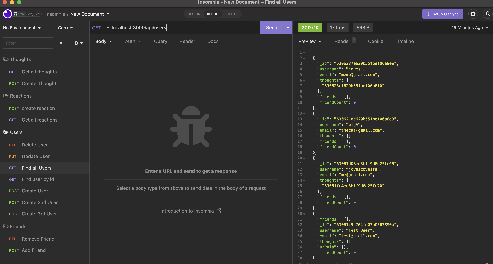
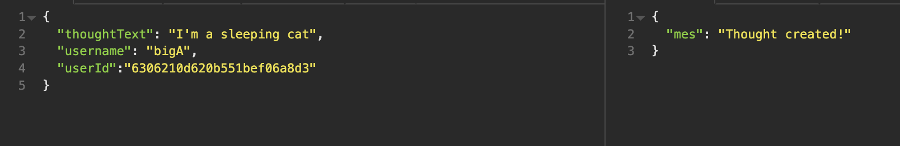
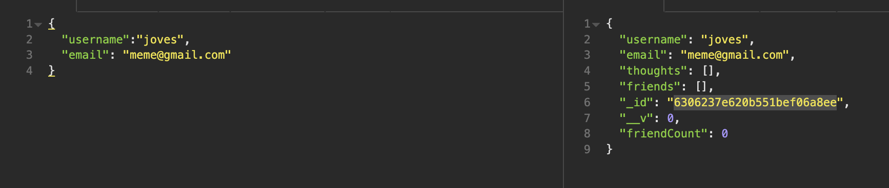

## The-Social-Network ft jesse

## Table of Contents 
 1. [Screenshots](#screenshots)
 2. [Description](#description)
 3. [Video Link](#video-link)
 4. [Video](#video)
 5. [User Story](#user-story)
 6. [Installation](#installation)
 7. [Utilized With](#utilized-with)
 8. [license](#license)

 
 ## screenshots
 - 
 - 
 - 

 ## video Link
 https://drive.google.com/file/d/19aNR2Vrqa3lwYnj5FC_3tG451QJF__1-/view?usp=sharing

 ## video

https://user-images.githubusercontent.com/106720762/186964526-6d44fdff-abe1-4426-8b69-d39a36f9f7a2.mp4

 
 ## description 
- This social media network allows the user to share their thoughts, reactions, add/remove friends, all within one product. Like facebook and twitter, but a looooot more simple. (and honestly? it is probably better that way.)

 ## user story
AS A social media startup
I WANT an API for my social network that uses a NoSQL database
SO THAT my website can handle large amounts of unstructured data

## installation
-- run application w/ `npm start`!!

## utilized-with
-- mongodb
-- mongoose
-- express

## license

None.
